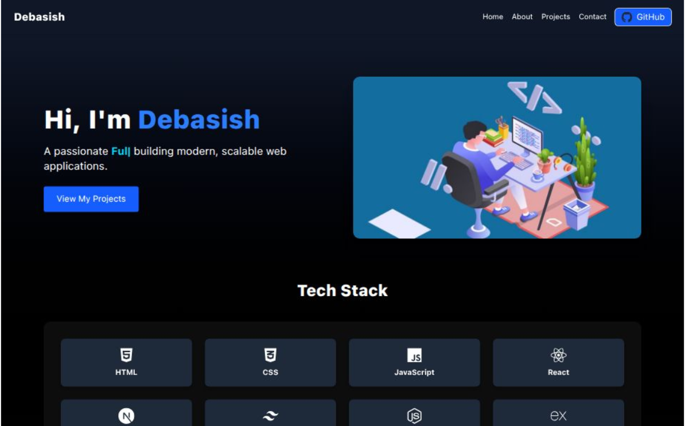

# 🌐 Personal Portfolio

A modern and responsive **Full-Stack Web Developer Portfolio** built with **Next.js 15**, **Tailwind CSS**, and **React Typed** for a dynamic and professional online presence.



## 🚀 Live Demo
🔗 [View Portfolio](https://portfolio-mqbv.vercel.app/)

---

## 📋 Features

- ⚡ **Next.js 15 (App Router)** for fast and SEO-friendly pages
- 🎨 **Tailwind CSS** for sleek, responsive design
- ⌨️ **React Typed** for dynamic typing animation in hero section
- 📱 Mobile-first responsive design
- 📇 Contact information with icons
- 🌙 Dark mode ready (optional)
- 🛠 Easy to customize

---

## 🛠 Tech Stack

- **Frontend:** Next.js, React, Tailwind CSS
- **Animations:** React Typed
- **Icons:** FontAwesome
- **Deployment:** Vercel

---

## 📦 Installation & Setup

```bash
# 1️⃣ Clone the repository
git clone https://github.com/2000Deba/Portfolio.git

# 2️⃣ Navigate into the project
cd portfolio

# 3️⃣ Install dependencies
npm install

# 4️⃣ Run the development server
npm run dev

# 5️⃣ Open in browser
http://localhost:3000
```

---

### 👨‍💻 Author

**👤 Debasish Seal**

- GitHub: [@2000Deba](https://github.com/2000Deba)
- Live Demo: [Portfolio](https://debasishseal.vercel.app/)

---

## 📜 License

This project is **source-available** under a custom license.

You are allowed to view, fork, and contribute to this repository for learning
and contribution purposes only.

❌ Reuse, redistribution, rebranding, modification, or commercial use is **not allowed**
without explicit permission from the author.

See the [LICENSE](./LICENSE) file for full details.

---

### ⭐ Support

If you find this project useful, please consider giving it a ⭐ star.

For bugs or feature requests, feel free to open an issue.