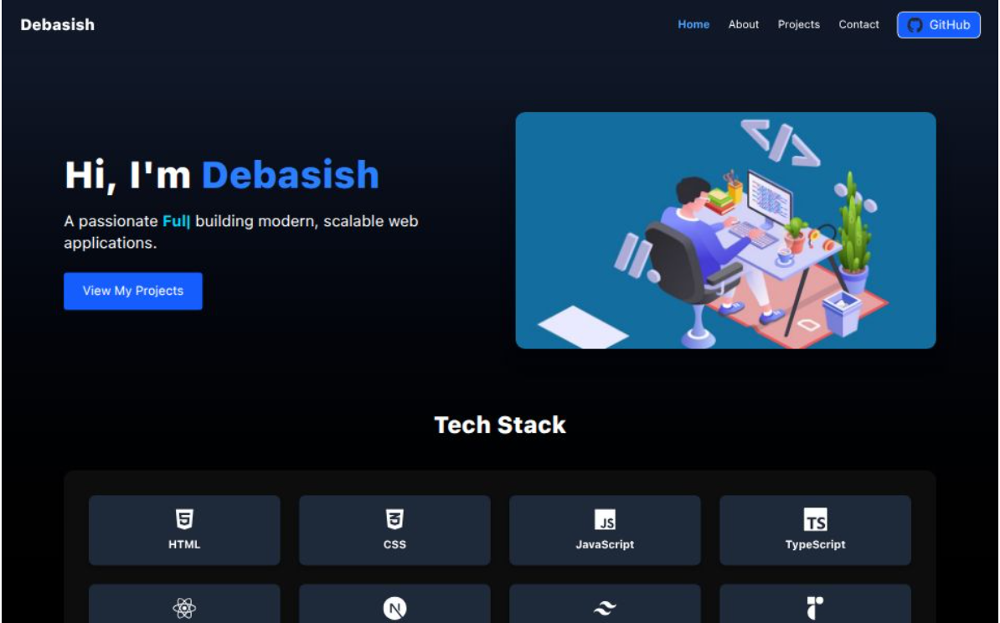

# 🌐 Personal Portfolio

> ⚠️ **IMPORTANT NOTICE**  
> This project is **source-available**, NOT open-source.  
> Deployment, redistribution, rebranding, or reuse is strictly prohibited  
> without explicit written permission from the author.

A modern and responsive **Full-Stack Web Developer Portfolio** built with **Next.js 15**, **Tailwind CSS**, and **React Typed** for a dynamic and professional online presence.



## 🚀 Live Demo
🔗 [View Portfolio](https://portfolio-mqbv.vercel.app/)

---

## 📋 Features

- ⚡ **Next.js 15 (App Router)** for fast and SEO-friendly pages
- 🎨 **Tailwind CSS** for sleek, responsive design
- ⌨️ **React Typed** for dynamic typing animation in hero section
- 📱 Mobile-first responsive design
- 📇 Contact information with icons
- 🌙 Dark mode ready (optional)
- 🛠 Easy to customize

---

## 🛠 Tech Stack

- **Frontend:** Next.js, React, Tailwind CSS
- **Animations:** React Typed
- **Icons:** FontAwesome
- **Deployment:** Vercel

---

## 📦 Installation & Setup

> ⚠️ This section is provided **only for learning and contribution purposes**.  
> Deployment or production use is **not allowed**.

```bash
# 1️⃣ Clone the repository
git clone https://github.com/2000Deba/Portfolio.git

# 2️⃣ Navigate into the project
cd portfolio

# 3️⃣ Install dependencies
npm install

# 4️⃣ Run the development server
npm run dev

# 5️⃣ Open in browser
http://localhost:3000
```

---

## 📦 Deployment Notes

- This project is deployed on **Vercel** for personal and demonstration purposes.

- Due to encryption keys, authentication providers, and email configurations,
this repository is **not intended for public or private redeployment under any name, domain, or branding**.

## 🔐 Usage Policy

- Viewing and learning: ✅ Allowed

- Contributions (PRs): ⚠️ Allowed (all contributions become property of the author).

- By submitting a pull request, you agree that your contribution
becomes part of the project and is subject to the same license terms.

- Forking: ⚠️ Allowed by GitHub, not permission to reuse

- Deployment / Rebranding / Commercial use: ❌ Not allowed

All forked copies remain bound to the same license terms.

---

### 👨‍💻 Author

**👤 Debasish Seal**

- GitHub: [@2000Deba](https://github.com/2000Deba)
- Live Demo: [Portfolio](https://debasishseal.vercel.app/)

---

### ⭐ Support

If you find this project useful, please consider giving it a ⭐ star.

For bugs or feature requests, feel free to open an issue.